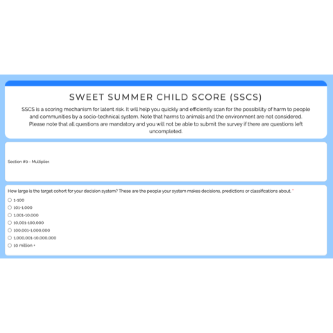

README
================

-   [Sweet Summer Child Score](#sweet-summer-child-score)
-   [Run Summer Summer Child app to assess the risk of your
    socio-technical
    system](#run-summer-summer-child-app-to-assess-the-risk-of-your-socio-technical-system)
    -   [1. From RStudio](#1-from-rstudio)
    -   [2. From the terminal](#2-from-the-terminal)
    -   [FAQ: If you’re having issues with R packages
        installation](#faq-if-youre-having-issues-with-r-packages-installation)

# Sweet Summer Child Score

Sweet Summer Child Score (SSCS) is a scoring mechanism for latent risk.
It will help you quickly and efficiently scan for the possibility of
harm to people and communities by a socio-technical system. This package
is an R version of Python code found at:
<https://github.com/summerscope/summerchildpy>

# Run Summer Summer Child app to assess the risk of your socio-technical system

How it looks like when you run it.



## 1. From RStudio

**Install and load the R package**

``` r
if(!require(devtools,quietly = TRUE))
  install.packages("devtools")
devtools::install_github("summerscope/summerchildr")
library(summerchildr)
```

**Run the app**

``` r
shiny::runApp(runSummerChildApp())
```

## 2. From the terminal

Run the following code in a terminal window - **Requires R (&gt;= 2.10)
to be installed**

    R -e "devtools::install_github('summerscope/summer-child-r', force = TRUE); library(summerchildr); runSummerChildApp()"

Click on the `http` link that appears in the terminal.

## FAQ: If you’re having issues with R packages installation

1.  Clone the repository

<!-- -->

    git clone git@github.com:summerscope/summerchildr.git
    cd summerchildr

2.  Run the app in the terminal after restoring the environment:

<!-- -->

    R -e "renv::restore(); library(summerchildr); shiny::runApp(runSummerChildApp())"

The same commands in the chunk above can be run in R Studio to restore
the environment before running the app.
